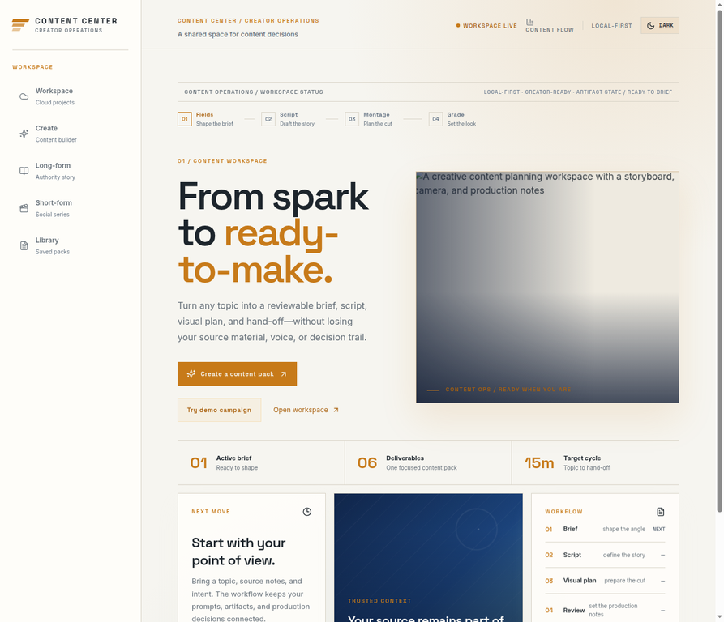
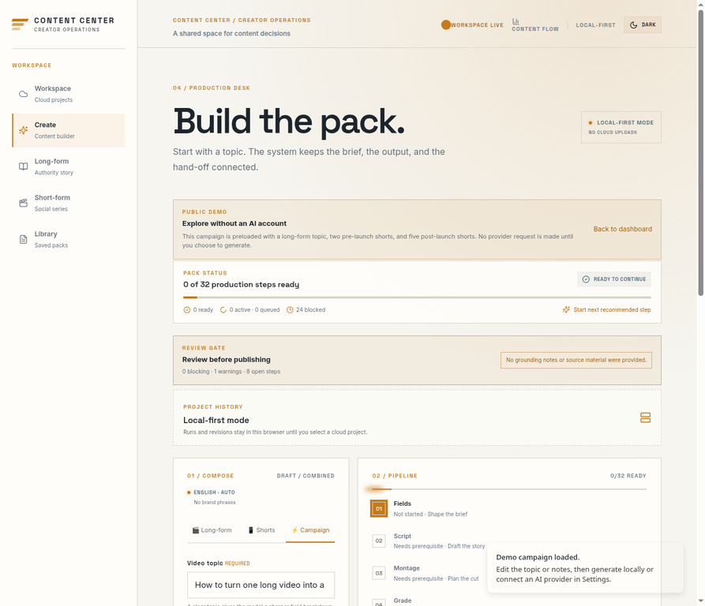

# Content Center

> A local-first, open-source production desk for turning one idea into a complete video campaign.

Content Center helps creators plan one long-form video, related shorts before and after the main release, and simple production guidance for publishing across multiple platforms. The default editing guidance uses **CapCut for simple montage** and **DaVinci Resolve for simple coloring**.

The project is designed for creators and beginner editors who want a clear, editable hand-off rather than an opaque block of AI-generated text. Content Center generates campaign structure, scripts, short-form variants, publication timing, simple shot guidance, basic color-correction notes, platform adaptations, and portable exports.

## Product promise

```text
One topic + notes
  → long-form video
  → pre-launch shorts
  → post-launch shorts
  → platform variants
  → simple CapCut montage guidance
  → simple DaVinci Resolve coloring guidance
  → editable Markdown / JSON hand-off
```

The default campaign contains one long-form video, two pre-launch shorts, and five post-launch shorts. Every asset is editable, labelled by its publication phase, and connected to the main topic.

## What Content Center is — and is not

| Content Center is | Content Center is not |
|---|---|
| A campaign planner and production hand-off tool | A video renderer or non-linear editor |
| A generator for long videos and related shorts | A CapCut or DaVinci automation tool |
| A simple montage and coloring guide | An advanced editing or color-grading course |
| Local-first and portable | A mandatory hosted account or subscription |
| Open to local AI and supported providers | A place to commit provider credentials |
| Editable and warning-aware | A factual approval system for AI output |

The initial product deliberately avoids advanced keyframing, masking, motion tracking, complex effect stacks, LUT design, advanced node trees, HDR finishing, auto-publishing, and broad collaboration. The purpose is to help a creator make the next practical production decision, not to replace professional editing software.

## Current runtime

The supported runtime is **React 19 + Vite + TypeScript** with the existing Express server boundary. The retained App Router files are migration history and are not the supported production runtime.

| Area | Current position |
|---|---|
| Campaign foundation | The active app has a typed combined-pack model and staged artifact workflow. |
| Long and short artifacts | Editable fields and production artifacts are supported in the current workflow. |
| Local persistence | Browser-local saving, backup, restore, and migration support are available. |
| Local AI | OpenAI-compatible browser-local endpoints are supported without browser-held credentials. |
| Known providers | Provider adapters, secure server-side routing, status, and exact model-ID discovery are available when the provider exposes a model-list endpoint. |
| Montage and coloring | Simple CapCut and DaVinci Resolve guidance is available by default. |
| Cloud workspaces | Optional and deferred behind explicit authentication and data-integrity gates. |

## Getting started

Requirements are Node.js 18+ and pnpm 10.18.1 or a compatible pnpm 10 release. The repository pins its package-manager version and keeps dependency overrides and patches in `pnpm-workspace.yaml` so fresh installs apply the same settings.

```bash
pnpm install --frozen-lockfile
pnpm dev
```

The development server selects the next available port when the default port is occupied. Open the localhost URL printed in the terminal.

The complete local quality gate is available as one command:

```bash
pnpm verify
```

It runs typecheck, tests, security scanning, accessibility smoke checks, public-fixture, release-notes-template, CODEOWNERS, branching-guide, license, support-guide, changelog, release-candidate, release-readiness, semantic theme, `pnpm validate:hero-asset`, and `pnpm validate:integrated-ui` contrast/responsive validation, followed by the production build and whitespace validation. The individual commands remain useful when narrowing down a failure.

### Try the public demo

You can explore the campaign workflow without an AI account, API key, or cloud workspace. Start the development server, open the dashboard, and choose **Try demo campaign**, or open `/generator?demo=1` directly. The demo loads a public-safe topic and notes, keeps the default two-before/five-after campaign shape, and does not make a provider request until you choose to generate.

The same scenario is available as a contributor fixture at [`fixtures/demo-campaign.json`](fixtures/demo-campaign.json). For troubleshooting and safe issue routing, see [`SUPPORT.md`](SUPPORT.md). Validate the fixture with:

```bash
pnpm validate:demo-fixture
```

## Public workflow preview

The screenshots below use the public-safe demo campaign. They contain no account data, provider credentials, or private campaign notes.



The dashboard presents the local-first workspace, the four-stage production flow, and the direct path into the public demo.



The generator keeps the public demo editable: the long-form topic, pre-launch teasers, post-launch extensions, review gate, and simple CapCut/DaVinci defaults remain visible before any provider request.

## AI connection modes

### Local AI — first-class mode

Local mode is the privacy-first path. The user can connect an OpenAI-compatible local endpoint such as LM Studio or a compatible local gateway by entering a base URL and model name. Local mode does not require a Content Center account.

A local endpoint is not automatically private: users should verify how their chosen runtime handles requests. Content Center should not claim that all local models have identical context limits, structured-output support, speed, or language quality.

### Known providers — optional mode

Known providers are routed through documented server-side adapters. Provider credentials must never be committed to GitHub, placed in public frontend environment variables, stored in ordinary browser storage, or written to logs or exports. Hosted-provider support uses a protected server boundary, privacy status, rate-aware diagnostics, sanitized errors, and model discovery where the provider exposes it.

The application should show whether a request is local or remote before generation, test the connection with a small request, and preserve clear error messages when a provider is unavailable.

## UI quality and public assets

The runtime uses semantic light and dark theme tokens for background, surface, border, text, link, focus, selected, and notification states. Status feedback uses text and icon cues in addition to color, and the integrated validator checks the required contrast pairs before the production build.

Settings can discover and display exact model IDs returned by a configured endpoint, including explicit loading, empty, success, and recovery states. Campaign Scope presents platforms as responsive accessible tiles backed by native checkboxes, with selected and available state copy that remains understandable without color alone.

The dashboard hero is a repository-tracked Vite asset at `client/src/assets/content-center-hero.jpg`; `pnpm validate:hero-asset` prevents a return to the unavailable `/manus-storage/` path. These checks keep a fresh GitHub checkout self-contained rather than dependent on session-only assets.

## Default campaign

| Asset | Default quantity | Publication phase |
|---|---:|---|
| Long-form video | 1 | Main release |
| Curiosity short | 1 | Before the main video |
| Promise short | 1 | Before the main video |
| Insight short | 1 | After the main video |
| Mistake short | 1 | After the main video |
| Quick-tip short | 1 | After the main video |
| Advanced-context short | 1 | After the main video |
| Question/community short | 1 | After the main video |

Users will be able to change the number and type of shorts. Pre-launch shorts should create interest without misleading viewers. Post-launch shorts should provide standalone value and may direct viewers to the full video.

## Simple production guidance

### CapCut montage

The default montage preset uses simple actions: hard cuts, removing pauses, short punch-ins, screen recordings, B-roll, readable captions, simple audio ducking, and occasional basic transitions. Each card explains what to record, where to cut, what to show, and what caption or audio cue to use.

The default workflow does not require complex masks, motion tracking, multi-layer effect systems, advanced keyframes, or transition collections.

### DaVinci Resolve coloring

The default coloring preset provides basic correction guidance: exposure, white balance, moderate contrast, restrained saturation, natural skin tone, and readable screen recordings. It explains a simple correction order and uses starting guidance rather than pretending that fixed numeric values work for every camera or lighting condition.

The default workflow does not require advanced node trees, LUT creation, HDR finishing, professional color-management configuration, or cinema-grade color science.

## Platform adaptation

The campaign model is designed to adapt a central idea to selected platforms without rewriting everything manually. Platform presets should remain versioned and editable because platform practices can change.

Initial platform families include YouTube, YouTube Shorts, Instagram Reels, TikTok, Facebook Reels, LinkedIn, and X-style feeds. A preset may define title and caption style, CTA, aspect-ratio guidance, safe-zone notes, schedule role, and export reminders.

## Privacy and security

The project is released under the [MIT License](LICENSE). Do not commit provider keys, OAuth secrets, database credentials, or private endpoint tokens. Use `.env.example` only as a placeholder reference. Review [SECURITY.md](SECURITY.md) before adding provider functionality.

The local-first mode is intended to work without an account. Optional cloud workspace features must not become a prerequisite for creating, editing, saving, or exporting a local campaign.

Optional analytics is disabled unless both `VITE_ANALYTICS_ENDPOINT` and `VITE_ANALYTICS_WEBSITE_ID` are explicitly configured. The default build does not request a placeholder URL or send campaign content to an analytics service.

## Repository map

| Path | Purpose |
|---|---|
| `client/src/lib/pack-domain.ts` | Typed campaign/pack state and reducer behavior. |
| `client/src/lib/generation-service.ts` | Stage generation orchestration and provider calls. |
| `client/src/lib/ai-provider.ts` | Browser-local provider seam. |
| `client/src/lib/ai-parser.ts` | Response parsing and artifact validation helpers. |
| `client/src/lib/content-storage.ts` | Local persistence, migration, backup, and restore. |
| `client/src/lib/pack-export.ts` | Markdown hand-off export. |
| `client/src/pages/Generator.tsx` | Current generator composition and workflow UI. |
| `server/` | Optional workspace and server-side persistence boundaries. |
| `scripts/` | Security, accessibility, build-audit, and public-fixture checks. |
| `fixtures/demo-campaign.json` | Public-safe campaign scenario for demos, screenshots, and contributor tests. |
| `ENHANCEMENT_PLAN_SCOPE_ALIGNED.md` | Scope-aligned enhancement and release plan. |
| `PUBLIC_RELEASE_CHECKLIST.md` | Maintainer checklist for the first public GitHub release. |
| `RELEASE_NOTES_TEMPLATE.md` | Maintainer template for public release announcements and safety notes. |
| `.github/dependabot.yml` | Weekly npm dependency-update configuration. |
| `.github/CODEOWNERS` | Default maintainer review ownership for repository changes. |
| `client/src/assets/content-center-hero.jpg` | Repository-tracked dashboard hero asset imported through Vite. |
| `docs/screenshots/` | Public-safe dashboard and demo-generator screenshots for documentation. |
| `docs/PRESET_AUTHORING.md` | Contributor contract for platform, CapCut, and DaVinci presets. |
| `docs/FIRST_CONTRIBUTION.md` | Beginner-friendly setup, demo-first reproduction, contribution paths, and validation checklist. |
| `docs/CAMPAIGN_SCOPE_UX_SPEC.md` | Campaign Scope information architecture, interaction states, accessibility, and responsive UX contract. |
| `docs/SEMANTIC_COLOR_NOTIFICATION_SPEC.md` | Shared light/dark semantic color, notification-state, contrast, focus, and reduced-motion contract. |
| `docs/BRANCHING_AND_RELEASE.md` | Dev, main, version-tag, and recovery workflow. |
| `LICENSE` | MIT license for public use and contribution. |
| `SUPPORT.md` | Public-safe troubleshooting and issue-routing guidance. |
| `CHANGELOG.md` | Public history and unreleased release-candidate changes. |
| `docs/RELEASE_VERIFICATION.md` | Clean-checkout automation and public-demo smoke evidence. |
| `docs/RELEASE_CANDIDATE.md` | Candidate tag identity, scope, evidence, and announcement requirements. |
| `scripts/validate-release-readiness.mjs` | Prevents tagging with incomplete release evidence or metadata. |
| `scripts/validate-hero-asset.mjs` | Verifies the tracked dashboard hero import and asset path. |
| `scripts/validate-integrated-ui.mjs` | Verifies semantic contrast, responsive platform hooks, accessibility hooks, model-discovery surfaces, and hero wiring. |

## Contributing

Start with the [first-contribution guide](docs/FIRST_CONTRIBUTION.md), then read [CONTRIBUTING.md](CONTRIBUTING.md) before opening a pull request. UX contributions to Campaign Scope should follow the [Campaign Scope UX specification](docs/CAMPAIGN_SCOPE_UX_SPEC.md) and the [semantic color and notification contract](docs/SEMANTIC_COLOR_NOTIFICATION_SPEC.md). New platform or editing-tool presets should be data-driven, documented, and covered by tests; see the [preset authoring guide](docs/PRESET_AUTHORING.md) for the contract. New provider integrations must include privacy behavior, credential handling, normalized errors, and contract fixtures. Maintainers should use the [branching and release workflow](docs/BRANCHING_AND_RELEASE.md), [public-release checklist](PUBLIC_RELEASE_CHECKLIST.md), [release verification record](docs/RELEASE_VERIFICATION.md), [release candidate record](docs/RELEASE_CANDIDATE.md), and [release-notes template](RELEASE_NOTES_TEMPLATE.md) before tagging or announcing a release.

## License and community status

The repository is intended to be a public GitHub project. Use the public-safe demo fixture when creating screenshots, examples, or issue reproductions. See [CODE_OF_CONDUCT.md](CODE_OF_CONDUCT.md), [CONTRIBUTING.md](CONTRIBUTING.md), and [SECURITY.md](SECURITY.md) for the current project policies.
